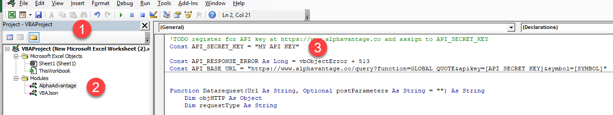
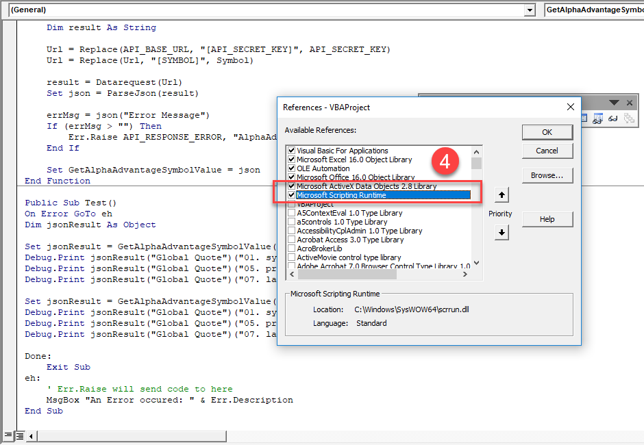

# VBA-GetJSON-RESTApi
Sample Excel VBA code to get JSON response from a JSON REST API
This example uses an API to return share values from https://www.alphavantage.co

The following shows an example JSON response
```
{
    "Global Quote": {
        "01. symbol": "BNC.L",
        "02. open": "362.7000",
        "03. high": "365.7500",
        "04. low": "360.3200",
        "05. price": "361.4500",
        "06. volume": "292676",
        "07. latest trading day": "2019-06-27",
        "08. previous close": "363.2500",
        "09. change": "-1.8000",
        "10. change percent": "-0.4955%"
    }
}

```

In order to run the code you will need to register for an API key at https://www.alphavantage.co and assign to the VBA code const API_SECRET_KEY

# IMPORTANT This code is provided as is without warranty of any kind and your use is at your own risk.

Source files are provided in TXT format which can be pasted into a new module in the excel VBA editor

The following steps are based on Excel 2016
goto url https://www.alphavantage.co and register for API key

## Access the VBA editor


Macro name 
Right click modules
Insert New Module and name AlphaAdvantage
paste code from alphaAdvantage.txt
Insert New Module and name VBAJson
paste code from VbaJson.txt

open module AlphaAdvantage
at top of module API_SECRET_KEY add your API key from above

## Add dependencies via \Tools References

Microsoft ActiveX Data Objects 2.8 library
Microsoft Scription Runtime

## Initial Test 
At the bottom of module AlphaAdvantage is a sub Test.
place cursor within and run code

View Immediate window should show Json data recieved from API

## Customize
amend code as required to return your symbols, assign data to spreadsheet cells etc.
